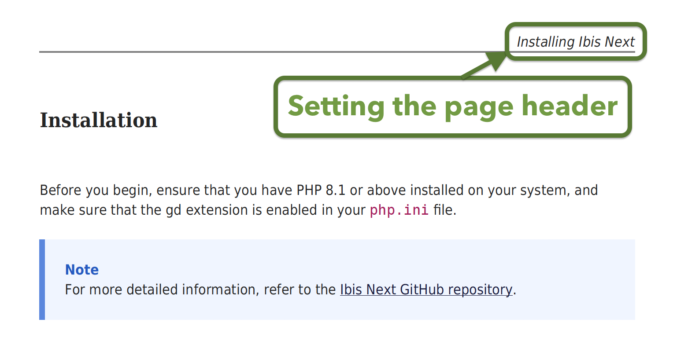

## Writing Your eBook

The `init` command will create sample .md files inside the `content` folder. You can explore those files to see how you can write your book.
This sample content is taken from [Ibis Next: create your eBooks with Markdown](https://github.com/Hi-Folks/ibis-next) by Roberto Butti.

Inside the `content` directory, you can write multiple `.md` files. Ibis uses the headings to divide the book into parts and chapters:

~~~markdown
# Part 1

`<h1>` tags define the start of a part. A separate PDF page will be generated to print the part title and any content below.

## Chapter 1

`<h2>` tags define the start of a chapter. A chapter starts on a new page always.

### Starting with Ibis

`<h3>` tags define different titles inside a chapter.
~~~

### Adding Aside
Inspired by the great Astro Starlight tool for creating technical documentation we support aside block.
Taking the definition from Astro Starlight documentation:
Asides (also known as “admonitions” or “callouts”) are useful for displaying secondary information alongside a page’s main content.

Ibis Next offers a tailored Markdown syntax designed for presenting asides. To demarcate aside blocks, use a set of triple colons `:::` to enclose your content, specifying the type as `note`, `tip`, `caution`, or `danger`.

While you have the flexibility to nest various other Markdown content types within an aside, it is recommended to use asides for brief and succinct portions of content.

~~~markdown
:::note
**Ibis Next** is an open-source tool, and you can contribute to the project by joining the [Ibis Next GitHub repository](https://github.com/Hi-Folks/ibis-next).
:::

:::warning
**Ibis Next** is an open-source tool, and you can contribute to the project by joining the [Ibis Next GitHub repository](https://github.com/Hi-Folks/ibis-next).
:::

:::tip
**Ibis Next** is an open-source tool, and you can contribute to the project by joining the [Ibis Next GitHub repository](https://github.com/Hi-Folks/ibis-next).
:::

:::danger
**Ibis Next** is an open-source tool, and you can contribute to the project by joining the [Ibis Next GitHub repository](https://github.com/Hi-Folks/ibis-next).
:::
~~~

You can also customize the title od the aside block using the square brackets `[your title]` in this way:

~~~markdown
:::tip[My two cents]
I want to give you a piece of advice: use **Ibis Next** to create your e-books.
:::
~~~

In the example above, the aside type "tip" was used (`:::tip`), with a custom title "My two cents" (`[My two cents]`) and the content of the block can contain text formatted with classic Markdown markers.

### Using images

Images can be added into the markdown in two different way:

1. using a remote image like

~~~markdown

~~~

2. using a relative path, in this case the path is realtive to the content directory, where you have your Markdown files (the default is `./content/`)

~~~markdown

~~~

It also works with absolute paths, but I don't recommend using this option as it's strongly tied to your specific machine.

### Adding a cover image
To use a cover image, add a `cover.jpg` in the `assets/` directory (or a `cover.html` file if you'd prefer a HTML-based cover page). If you don't want a cover image, delete these files.
If your cover is in a PNG format you can store the file in the `assets/` directory and then in the `ibis.php` file you can adjust the `cover` configuration where you can set the cover file name, for example:

~~~php
    'cover' => [
        'position' => 'position: absolute; left:0; right: 0; top: -.2; bottom: 0;',
        'dimensions' => 'width: 210mm; height: 297mm; margin: 0;',
        'image' => 'cover.png',
    ],
~~~

### Setting the page headers

In Ibis Next, you have the flexibility to set a customized header for your pages. To do this, navigate to the `ibis.php` configuration file and locate the `header` parameter.
Within the `ibis.php` file, you can specify your desired header like this:

~~~php
     /**
      * CSS inline style for the page header.
      * If you want to skip header, comment the line
      */
     'header' => 'font-style: italic; text-align: right; border-bottom: solid    1px #808080;',
~~~
This allows you to personalize the header content according to your preferences. Feel free to modify the value within the single quotes to suit your specific requirements. The value of the `header` parameter is the CSS inline style you want to apply to your page header.
If you don't need or don't want the page header in your eBook you can eliminate the `header` parameter.

If you want to customize the text of the page header for each section, in the markdown file, you can add in the frontmatter section the `title` parameter:

~~~markdown
---
title: My Title
---

## My Section Title
This is an example.

~~~

### Using Fonts

Edit your `/ibis.php` configuration files to define the font files to be loaded from the `/assets/fonts` directory. After that, you may use the defined fonts in your themes (`/assets/theme-light.html` & `/assets/theme-dark.html`).
